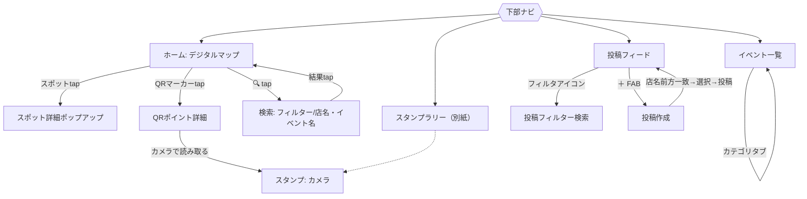

# 市民祭りデジタルパンフレットアプリ 仕様書

| 項目 | 内容 |
|---|---|
| 文書名 | 市民祭りデジタルパンフレットアプリ 機能仕様書 |
| バージョン | v0.2（ドラフト） |
| 作成日 | 2026-08-04 |
| ステータス | レビュー用ドラフト |
| 想定運用 | Phase 1: 某市 市民祭り（テスト運用） → Phase 2: 某市 マップ型SNS（本運用） |
| 別紙 | スタンプラリー機能プロンプト（`stamp_rally_prompt.md`）を参照 |

> 本書は「まず市民祭り用として動かし、のちに市全体のマップ型SNSへ運用移行する」ことを前提に、**移行時に作り直しが発生しにくい設計**を重視して記述しています。将来変わる部分（祭り固有）と変わらない部分（SNSの土台）を明確に分けています。

> **更新履歴** — v0.2：ホーム地図に「スタンプラリーQRの設置場所」を表示する機能を追加（5.1.1／5.4／6.2、画面遷移図を更新）。

---

## 1. 概要

### 1.1 目的
某市の市民祭りにおける**紙のパンフレット・会場マップのデジタル代替**を提供する。来場者はスマホで、会場マップ・出店/イベント情報・スタンプラリー・口コミ投稿を利用できる。将来的には祭り期間に限らず、**市内のスポットを地図上で見て・探して・投稿できるマップ型SNS**へ発展させる。

### 1.2 運用フェーズ
- **Phase 1（テスト運用・市民祭り）**：祭り会場のイラストマップを中心とした「デジタルパンフレット＋簡易SNS（口コミ）」。期間・会場・出店が固定。
- **Phase 2（本運用・マップ型SNS）**：市全域の実地図をベースに、常設スポット・ユーザー投稿・フォロー等を備えた継続運用型SNS。祭りは「その上で開催される1イベント」という位置づけになる。

### 1.3 対象ユーザー
- 来場者・市民（一般利用者）。年齢層が広いため、**直感的な操作**と**低速回線・混雑環境での動作**を重視。
- 運営・出店者（Phase 1では管理側でデータ登録。Phase 2で出店者/店舗による自己投稿も想定）。

### 1.4 対応プラットフォーム
- **スマホのブラウザで開くWebアプリ（PWA推奨）**。前会話のスタンプラリー方針（スマホWebアプリ）と統一する。
- インストール不要でURLから即利用でき、PWA化してホーム追加・オフラインキャッシュにも対応させる（当日の圏外・混雑対策）。

---

## 2. 全体設計方針（SNS移行を見据える）

### 2.1 基本コンセプト：「地図 × スポット × 投稿」
アプリの本質を**3つの汎用要素**に還元して設計する。祭りもSNSもこの組み合わせで表現できる。

- **地図（Map）**：スポットを配置する土台。Phase 1はイラストマップ、Phase 2は実地図。
- **スポット（Spot）**：地図上の点。祭りでは「出店・団体・ステージ・エリア」、SNSでは「店・施設・名所などのPOI」。同じ器で扱う。
- **投稿（Post）**：スポットに紐づくユーザーの口コミ/写真。これが**そのままSNSのコア機能**になる。

### 2.2 汎用データモデルによる将来拡張
祭り固有の言葉（「出店」「会場」）をDBの型名にせず、**汎用名（Spot / Event / Category / Tag / Post / User）**で設計する。祭りは `Event` の一種にすぎず、SNS移行時にデータ構造を作り直さずに済む。

### 2.3 マップの抽象化（イラストマップ ⇔ 地理マップ）
地図描画を**共通インターフェース（MapProvider）**で抽象化し、実装を2種類差し替え可能にする。

- **ImageMap（Phase 1）**：イラスト地図PDF/画像を表示し、その上に**画像座標（x, y）でスポットのマーカー**を重ねる。ピンチズーム/スワイプ対応。
- **GeoMap（Phase 2）**：実世界のタイル地図（緯度経度）にスポットを配置。

スポットは「画像座標」と「緯度経度」の**両方を保持できる**構造にしておく（下記2.4・6.2参照）。祭りのイラストマップにも**地理参照（ジオリファレンス）**を与えておけば、Phase 1の段階から端末GPSで「現在地表示」も可能になり、Phase 2への地続きの移行ができる。

### 2.4 フェーズ間の対応表（変わる／変わらない）

| 概念 | Phase 1（市民祭り） | Phase 2（マップ型SNS） | 移行方針 |
|---|---|---|---|
| 地図 | イラストマップ（ImageMap） | 実地図（GeoMap） | MapProviderを差し替え |
| スポット | 出店・団体・ステージ・エリア | 店・施設・名所などPOI | 同一 `Spot` 型を継続利用 |
| イベント | 祭り本体（固定1件） | 常設＋随時開催の多イベント | `Event` を複数化 |
| カテゴリ/タグ | 祭り用の分類 | 市全体の分類へ拡張 | 同一タクソノミーを拡張 |
| 投稿（口コミ） | 口コミ＋写真 | フィード/フォロー付きSNS | 同一 `Post` を機能拡張 |
| ユーザー | ニックネームのみ（簡易） | 認証・プロフィール・フォロー | `User` を最初から用意し拡張 |
| スタンプラリー | あり（祭り限定） | 任意（イベント連動機能） | `Event` 付属機能として分離 |

---

## 3. システム構成・技術要件

### 3.1 アーキテクチャ
- フロント：スマホWebアプリ（SPA/PWA）。
- バックエンド：スポット/投稿/ユーザーを管理するAPIサーバ＋DB。
  - Phase 1は最小構成（読み取り中心＋口コミ投稿）でも可。ただし**データモデルはPhase 2を見据えて設計**する（3.4）。
- 管理画面（運営用）：スポット・カテゴリ・タグ・地図アセットの登録/編集。

### 3.2 技術スタック（推奨・確定前）
- フロント：**React + TypeScript**（Vite）、PWA対応、状態管理は軽量に。
- 地図：ImageMap は Canvas/SVG もしくは `leaflet` の画像オーバーレイ機能。GeoMap は `MapLibre GL` / `Leaflet` 等（Phase 2）。**同一の地図抽象レイヤ配下で差し替える**。
- バック：REST または GraphQL API。DBはリレーショナル（PostgreSQL＋位置情報拡張 PostGIS 想定）。
- 認証：Phase 1はニックネームのみ（端末ローカル）、Phase 2で本認証（メール/SNSログイン）に拡張できる構成。

> スタックは確定前提。既存資産・運用体制に合わせて置き換え可。重要なのは「地図抽象化」と「汎用データモデル」の2点を守ること。

### 3.3 地図の実装方針（重要）
「地図PDFを位置情報対応させたい」への具体方針：

1. **ベース画像化**：地図PDFを高解像度画像（必要ならタイル分割）に変換し、ズーム/パンで軽快に閲覧できるようにする。
2. **スポットのマーカー重畳**：各スポットを画像座標（x, y）で登録し、タップ可能なマーカー/領域として重ねる。タップでポップアップ（5.1）。
3. **ジオリファレンス（任意・推奨）**：地図画像の複数基準点に実緯度経度を割り当て、画像座標↔緯度経度を相互変換可能にする。これにより端末GPSで**現在地ピン**を表示でき、Phase 2の実地図へ**スポット座標をそのまま流用**できる。

### 3.4 データストア
- スポット・カテゴリ・タグ・投稿・ユーザー・イベント・地図アセットを保持。
- 位置は画像座標と緯度経度の両方を許容（NULL許容）。
- 祭り固有情報は `Event` 配下に隔離し、削除・追加が容易な構造にする。

---

## 4. 画面構成・遷移

### 4.1 グローバルナビゲーション（画面下部バー）
左から4タブ。全画面共通。

1. **ホーム**（デジタルマップ）
2. **イベント一覧**
3. **スタンプラリー**（別紙参照）
4. **投稿**（口コミフィード）

### 4.2 画面一覧
- ホーム（マップ）／会場切替
- 検索（フィルター検索・店名/イベント名検索）
- スポット詳細ポップアップ
- イベント一覧（カテゴリタブ切替）
- スタンプラリー一式（別紙）
- 投稿フィード
- 投稿フィルター検索
- 投稿作成

### 4.3 画面遷移図（概略）

---

## 5. 機能仕様（画面別）

### 5.1 ホーム画面（デジタルマップ）
- 会場のイラストマップを全画面表示。**ピンチズーム／スワイプ**で拡大・移動。
- 会場が複数ある場合は**上部に会場切替**（UI案の「第1会場」ヘッダーに相当）。
- マップ上の各スポットは**タップ可能**。タップで**詳細ポップアップ**を表示：
  - **ジャンルタグ**（色分け。例：グルメ＝ピンク系、団体/模擬店＝青緑系）
  - **スポット名**（UI案「U：店名」「11：店名」の番号/記号＋名称）
  - **詳細テキスト**
  - **関連タグボタン**（例：ドリンク／肉／オススメ）——共通フィルター（6.1）と同一。
- 画面**右下に🔍検索ボタン（FAB）**。タップで検索へ（5.2）。
- **スタンプラリーのQR設置場所を地図上に表示**（5.1.1）。
- 下部にグローバルナビ（4.1）。

補足（データ）：各スポットは `mapId` と画像座標 `(x, y)`、任意で緯度経度を持つ（6.2）。

#### 5.1.1 スタンプラリーQRの地図表示
- 会場に設置されたスタンプラリーのQRコード（全7か所）の位置を、**店舗ピンとは別デザインのQRマーカー**（番号付き）で地図上に表示する。
- 地図上部のトグル（「スタンプQRの場所」）で**表示／非表示を切り替え**できる。
- QRマーカーをタップすると、**取得状況**（未取得／取得済み・獲得文字）と、その場で**「カメラで読み取る」**ボタン（⑤カメラ画面へ遷移）を表示。
- スタンプの収集状況と**連動**し、取得済みのポイントは**色を変えて✓表示**（未取得と一目で区別）。地図を見れば残りのポイントが分かる。
- 各QRポイントは `Spot`（種別＝スタンプQR）として `mapId / x / y`（＋任意で緯度経度）を持ち、`stampCheckpointId` で合言葉の1文字と結びつく（6.2・5.4）。共通の地図・スポット基盤の上に載るため、Phase 2でも同じ仕組みで扱える。

### 5.2 検索機能
ホームの🔍から遷移。2種類の検索を提供し、**結果は地図上で位置を示す**。

- **フィルター検索**：あらかじめ用意された共通フィルター（ドリンク／肉／ワークショップ 等）をタップ → 該当スポットが**地図上でどこにあるかハイライト表示**。
- **店名＆イベント名検索**：**前方一致**で検索。候補（3件程度）を**地図上に位置表示**。
- フィルターの語彙はアプリ内共通（6.1）。イベント一覧・投稿フィルターと同じ定義を用いる。

### 5.3 イベント一覧画面
- マップのスポット情報のリスト化＋ステージ催し物の詳細を一覧。
- **上部に横スクロールのカテゴリタブ**：グルメ／紹介PR／商品販売／メインステージ／プレイランド／特産品販売コーナー …（**スライドで全項目表示**）。
- タブ選択で該当カテゴリのスポット/イベントをリスト表示。
- 各リスト項目：**番号・名称・詳細・画像**（UI案準拠）。
- **ステージ系カテゴリ**（メインステージ等）は**開始時刻**（例：11:00〜、12:00〜）を表示。
- 選択中タブは**下線＋色**で示す（UI案のタブ配色に準拠）。

### 5.4 スタンプラリー
別紙 `stamp_rally_prompt.md` に定義（注意事項→遊び方→参加登録→QR収集→合言葉完成→景品交換）。**Phase 2ではイベント連動の任意機能**として分離できるよう、スタンプ対象を `Spot`（チェックポイント）に紐づけて管理する。

各チェックポイント（QR設置場所）は**ホーム地図上にも表示**され、取得状況が地図と同期する（5.1.1）。地図のQRマーカーからカメラを起動して、その場で読み取りに進むこともできる。

### 5.5 投稿画面（口コミフィード）
- 参加者の口コミを**フィード表示**：ユーザーアイコン＋ニックネーム、本文、**いいね（ハート）**。
- **左下にフィルターアイコン**（UI案の漏斗マーク、選択数バッジ）→ 投稿フィルター検索（5.5.1）。
- **右下＋（FAB）** → 投稿作成（5.6）。

#### 5.5.1 投稿フィルター検索
- **タグフィルター**（グルメ／ワークショップ／ドリンク 等：共通フィルター 6.1）で、該当**店に紐づく口コミ**を絞り込み。
- **店名検索**（1:店名、2:店名 … のリスト、前方一致）で対象店の口コミに絞り込み。
- 「ドリンクを選択 → ドリンク提供店の口コミ表示」のように、**タグは店にあらかじめ紐づく**（6.1・6.2）。

### 5.6 投稿作成画面
- **店名/イベント名を前方一致検索** → 候補リスト表示 → **タップで投稿対象を選択**。
- **キャプション（テキスト）**と**画像**を添付（「＋追加する」）。
- 投稿すると：フィードに反映され、**対象スポットの口コミにも紐づく**（5.5.1のフィルタ対象になる）。

---

## 6. 共通機能・データ設計

### 6.1 共通フィルター（カテゴリ／タグ）——アプリ内で一元管理
「ドリンク」「肉」「ワークショップ」等のフィルターは**アプリ全体で共通の1つの定義**を用い、マップ検索・イベント一覧・投稿フィルターで**同じものを参照**する。二重管理を避け、SNS移行時の拡張も1か所で行える。

- **Category（大分類）**：グルメ／紹介PR／商品販売／メインステージ／プレイランド／特産品販売 …（イベント一覧タブに対応）
- **Tag（横断タグ）**：ドリンク／肉／ワークショップ／オススメ …（フィルター・検索・口コミ絞り込みに対応）
- 各スポットは 1つの Category＋複数の Tag を持つ。

### 6.2 スポット（店舗・イベント）マスタ
中核エンティティ。祭りもSNSも同一型で扱う。

| フィールド | 説明 |
|---|---|
| id | 一意ID |
| name | 名称（番号/記号＋店名） |
| categoryId | 所属カテゴリ（6.1） |
| tagIds[] | 横断タグ（6.1） |
| description | 詳細 |
| images[] | 画像 |
| mapId / x / y | 表示する地図と画像座標（ImageMap用） |
| lat / lng | 緯度経度（任意。GeoMap・GPS用） |
| schedule | 開始/終了時刻（ステージ等のイベント系のみ） |
| eventId | 所属イベント（Phase 1は祭り、Phase 2で複数化） |
| stampCheckpointId | スタンプラリーのQR設置場所の場合の識別（任意）。合言葉の1文字と対応 |

※ スタンプラリーのQR設置場所も **`Spot`（種別＝スタンプQR）** として管理し、`mapId / x / y`（＋任意で緯度経度）と `stampCheckpointId` を用いて、地図表示・取得状況の同期・カメラ起動導線（5.1.1）を実現する。店舗スポットと同じ器で扱うため、専用のデータ構造は不要。

### 6.3 投稿（口コミ）データ
| フィールド | 説明 |
|---|---|
| id | 一意ID |
| userId | 投稿者 |
| spotId | 対象スポット |
| caption | 本文 |
| images[] | 添付画像 |
| likeCount | いいね数 |
| createdAt | 投稿日時 |

### 6.4 ユーザー
- **Phase 1**：ニックネームのみ（端末ローカル保持でも可。※スタンプラリー登録と共通化を検討）。
- **Phase 2**：認証（メール/SNSログイン）、プロフィール、フォロー/フォロワー、通知などへ拡張。
- **最初から `User` エンティティを用意**し、Phase 1では最小項目のみ使用することで移行を容易にする。

### 6.5 データモデル関連（概念）
- `Event` 1 — n `Spot`
- `Spot` 1 — n `Post`
- `Spot` n — 1 `Category`、`Spot` n — n `Tag`
- `User` 1 — n `Post`
- `Map` 1 — n `Spot`（画像座標）／`Spot` は任意で緯度経度も保持

---

## 7. マップ型SNSへの移行方針

### 7.1 移行で「変わらない」もの（資産として継続利用）
- `Spot` / `Category` / `Tag` / `Post` / `User` の各データと関係。
- 共通フィルター（6.1）と検索・絞り込みロジック。
- 投稿・いいね・口コミの仕組み（SNSのコアへ直結）。

### 7.2 移行で「変わる」もの
- **地図**：ImageMap → GeoMap（実地図タイル）。MapProviderの差し替えで対応。スポットに緯度経度が入っていれば再配置は最小限。
- **イベント**：固定1件 → 複数・常設。祭りは「1つの `Event`」として残す。
- **ユーザー**：簡易 → 本認証・フォロー・通知。
- **スタンプラリー**：祭り限定機能 → 任意のイベント連動機能に分離。

### 7.3 移行を容易にするための設計上の約束事（必須）
1. 祭り固有名称をDB型名・API名に使わない（汎用名で統一）。
2. 位置は**画像座標と緯度経度の両方**を保持できるようにする（Phase 1から緯度経度も可能な限り入力）。
3. フィルター/カテゴリは**単一の共通マスタ**で管理する。
4. 祭り固有データは `Event` 配下に隔離する。
5. `User` を最初から用意し、Phase 1でも投稿の作者として紐づけておく。

### 7.4 移行ロードマップ（段階案）
1. Phase 1：イラストマップ＋口コミで市民祭り運用。データは汎用モデルで蓄積。
2. 中間：祭りマップにジオリファレンスを付与し、GPS現在地表示を試験導入。
3. Phase 2：GeoMapへ切替、複数イベント・常設スポット・本認証・フォロー等を段階追加。

---

## 8. 非機能要件
- **対応環境**：iOS Safari／Android Chrome の最新系。スマホ縦画面ファースト。
- **性能**：地図の初回読み込み最適化（画像タイル化/圧縮）。低速回線・混雑環境を想定。
- **オフライン**：PWAキャッシュで、マップ・出店情報など静的データは圏外でも閲覧可能に（当日対策）。
- **位置情報**：GPS利用は**明示的許可制**。取得データはナビ用途に限定し保持しない方針を基本とする。
- **プライバシー/個人情報**：Phase 1はニックネームのみ推奨（個人情報を極力持たない）。投稿は公開前提であることを明示。
- **投稿の健全性**：Phase 2で通報・非表示・モデレーション機能を追加（Phase 1は運営目視でも可）。
- **アクセシビリティ**：タップ領域は十分な大きさ、文字サイズ配慮、色だけに依存しない表現。
- **多言語**：将来的な多言語化を見据え、UI文言を外部化しておく（Phase 2）。

---

## 9. 未確定事項・確認事項
1. 地図の**ジオリファレンス実施可否**（GPS現在地表示を行うか）。
2. Phase 1のユーザーの扱い（ニックネームのみ／ログインの要否、スタンプラリー登録との統合可否）。
3. **会場数**（第1会場のみか複数か）と、会場切替UIの要否。
4. **カテゴリ/タグの確定版**一覧（イベント一覧タブ＝カテゴリ、フィルター＝タグの最終リスト）。
5. 投稿の**モデレーション方針**（事前/事後、通報機能の要否）。
6. スタンプラリー（別紙）とアプリ本体の**データ連携範囲**（チェックポイント＝スポットの紐づけ）。
7. **QRポイントの地図座標の登録方法**（管理画面で画像座標を指定する等）と、初期表示ON/OFFの既定値。
8. Phase 2（SNS）への**移行時期・機能スコープ**（フォロー、通知、DM等の要否）。
9. 画像・地図PDF等の**アセット提供元と著作権/利用範囲**。

---

## 10. 用語集
- **スポット（Spot）**：地図上の1点。出店・団体・ステージ・エリア・（SNSでは）店/施設/名所などを包括する汎用単位。
- **イベント（Event）**：スポット群をまとめる催し。Phase 1では市民祭り本体を指す。
- **カテゴリ（Category）**：スポットの大分類（イベント一覧タブに対応）。
- **タグ（Tag）**：横断的な属性（フィルター・口コミ絞り込みに対応）。
- **投稿（Post）**：スポットに紐づくユーザーの口コミ/写真。
- **ImageMap / GeoMap**：イラスト画像地図／実地図タイル。共通の地図抽象レイヤ配下で切替。
- **ジオリファレンス**：地図画像に実緯度経度を対応づけること。
